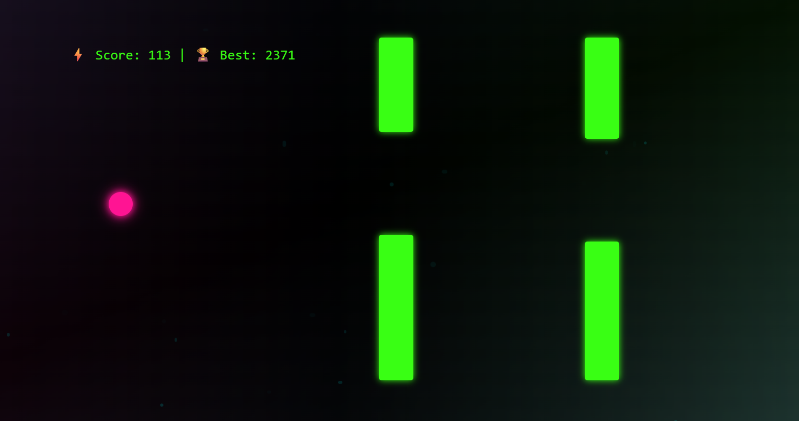

# 🚀 Flappy Neon

Un petit jeu **Flappy Bird** stylisé en **dark, neon & robotic**, développé en React + Vite + Tailwind CSS.  
✅ Responsive, best score sauvegardé, fond animé, musique électro/techno et déploiement sur GitHub Pages.

 <!-- tu peux mettre un screenshot -->

---

## ✨ Fonctionnalités

- 🐦 Flappy Bird stylé *neon* avec glow
- 🎵 Musique electro/techno en boucle (démarre au début)
- 🏆 Best score sauvegardé en `localStorage`
- 🌌 Fond animé + particules brillantes
- 📱 Responsive (mobile & desktop)
- ⚡ Contrôles simples : clic souris ou touche `Espace`
- 🏠 Écran d’accueil avec bouton “Jouer”
- 🔥 Déploiement facile sur GitHub Pages

---

## 📦 Technologies utilisées

- [React](https://reactjs.org/)
- [Vite](https://vitejs.dev/)
- [Tailwind CSS](https://tailwindcss.com/)
- HTML5 Audio API
- LocalStorage pour le best score

---

## 🚀 Développement local

```bash
# Cloner le projet
git clone https://github.com/tonpseudo/flappy-neon.git
cd flappy-neon

# Installer les dépendances
npm install

# Lancer en mode développement
npm run dev
